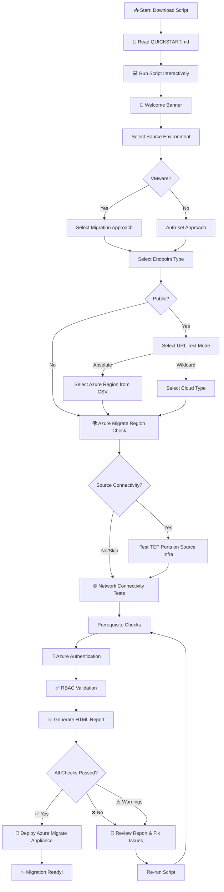

# Azure Migrate Appliance Readiness Check

[](https://github.com/PowerShell/PowerShell)
[](LICENSE)
[]()

Comprehensive PowerShell script to validate prerequisites, network connectivity, authentication, and Azure RBAC permissions required for Azure Migrate appliance deployment.

---

## 💡 Why This Repository Exists

Deploying an Azure Migrate appliance is not always straightforward. In practice, migrations frequently stall or fail due to issues that could have been caught **before** the appliance was ever deployed — things like:

- Firewall rules blocking required Azure endpoints
- Missing Contributor permissions on the subscription or resource group
- Device Code Flow authentication blocked by an organizational policy
- Hardware on the appliance VM not meeting minimum requirements
- Physical servers that are unreachable from the appliance network
- Expired or misconfigured Entra ID App certificates

These issues typically surface **mid-deployment or after**, causing delays, rollbacks, and escalation to multiple teams.

**This repository solves that problem.** It gives migration engineers, IT administrators, and cloud architects a single script to run on the appliance machine *before* any deployment starts. It validates every prerequisite in one pass and produces a report you can review, share with your team, or keep for audit purposes.

### Who Is This For?

| Role | How You Use This |
|------|-----------------|
| **Migration Engineer** | Run before every appliance deployment to catch blockers early |
| **IT Administrator** | Validate network and permissions without needing Azure expertise |
| **Cloud Architect** | Review the HTML report to confirm environment readiness |
| **DevOps / Automation** | Integrate into CI/CD pipelines for repeatable validation |

### When Should You Run This?

- ✅ **Before** deploying the Azure Migrate appliance
- ✅ **After** a network or firewall change that may affect appliance connectivity
- ✅ **When troubleshooting** an appliance that stopped working
- ✅ **Periodically** (e.g. weekly) to ensure continued compliance

---

## 📚 Documentation

| Document | Description |
|----------|-------------|
| **[Quick Start Guide](QUICKSTART.md)** | 🚀 Get started in 3 steps - Perfect for first-time users |
| **[Command Examples](EXAMPLES.md)** | 💻 20+ copy-paste ready examples for all scenarios |
| **[Contributing Guidelines](CONTRIBUTING.md)** | 👥 How to contribute to this project |
| **[License](LICENSE)** | 📄 MIT License details |
| **[This README](#)** | 📖 Complete reference documentation |
| **[Sample CSV](PhysicalServersExample.csv)** | 📊 Template for physical servers connectivity testing |
| **[URL CSV](MigrateAppliance_ListofURLs_v3.0_combined.csv)** | 🌐 Region-specific absolute URLs for network testing |

---

## ⚡ Quick Start

**New to this script?** → Start with the **[Quick Start Guide](QUICKSTART.md)** (5 minute read)

### Run in 3 Steps:

```powershell
# 1. Download or clone this repository
# 2. Open PowerShell as Administrator
# 3. Run the script
.\AzureMigrateApplianceReadinessCheck.ps1
```

The script will interactively guide you through all options!

### What It Validates:

- ✅ **Prerequisites**: PowerShell version, execution policy, OS version, hardware requirements, FIPS mode, time sync
- ✅ **Network Connectivity**: Two URL testing modes — Wildcard (DNS) or Absolute (region-specific CSV)
- ✅ **Azure Authentication**: Device Code Flow and Entra ID App Registration methods
- ✅ **RBAC Validation**: Subscription and resource group permissions, Azure Migrate roles, resource providers
- ✅ **Migration Configuration**: Agentless (VMware, Hyper-V) and Agent-based (Physical/AWS/GCP servers)
- ✅ **Physical Servers**: CSV-based connectivity validation
- ✅ **Comprehensive Reporting**: HTML report with detailed findings and recommendations

> **Note:** Post-discovery features (Software Inventory, SQL/Web App Discovery, Dependency Analysis) are configured in the appliance configuration manager after setup and validated by the appliance itself.

---

## 📖 Table of Contents

- [Why This Repository Exists](#-why-this-repository-exists)
- [Documentation](#-documentation)
- [Quick Start](#-quick-start)
- [Complete Workflow](#-complete-workflow-first-time-users)
  - [Visual Workflow Diagram](#visual-workflow)
- [Interactive vs Automated Mode](#-interactive-vs-automated-mode)
- [Prerequisites](#-prerequisites)
- [Parameters Reference](#-parameters)
- [Usage Examples](#-usage-examples)
  - [VMware Agentless](#scenario-1-vmware-agentless-migration-with-sql-discovery)
  - [Hyper-V Agentless](#scenario-3-hyper-v-with-private-endpoints)
  - [Physical Agent-Based](#scenario-2-physical-servers-with-agent-based-discovery)
- [Migration Approaches](#-migration-approaches)
- [Authentication Methods](#-authentication-methods)
- [Network Connectivity](#-network-connectivity)
- [Report Output](#-report-output)
- [Troubleshooting](#-troubleshooting)
- [Additional Resources](#-additional-resources)
- [Best Practices](#-best-practices)
- [Version History](#-version-history)
- [License](#-license)
- [Contributing](#-contributing)

---

## 🎯 Complete Workflow (First Time Users)

**New to Azure Migrate?** Follow this workflow for a successful validation:

1. **📖 Read the Quick Start** → **[QUICKSTART.md](QUICKSTART.md)** (5 minutes)
   - Understand what the script does
   - Check prerequisites checklist
   - See what output to expect

2. **💻 Run the Script Interactively** 
   ```powershell
   .\AzureMigrateApplianceReadinessCheck.ps1
   ```
   - Review the welcome banner
   - Select source environment, endpoint type, and URL testing mode
   - Follow the prompts (takes 5-10 minutes)
   - Sign in to Azure when asked

3. **📊 Review the Results**
   - HTML report opens automatically in your browser
   - Check for any ❌ Failed or ⚠️ Warning items
   - Review recommendations for each issue

4. **🔧 Fix Issues if Needed**
   - Follow recommendations in the report
   - See [Troubleshooting](#-troubleshooting) section below
   - Re-run the script to verify fixes

5. **✅ Proceed with Appliance Deployment**
   - Once all checks pass, you're ready!
   - Follow Azure Migrate documentation to deploy appliance
   - Keep the report for future reference

**Need automation?** After your first run, check **[EXAMPLES.md](EXAMPLES.md)** for parameter-based execution examples.

### Visual Workflow



---

## 🚀 Interactive vs Automated Mode

### Interactive Mode (Recommended for Manual Setup)
```powershell
# Simply run - the script will prompt you for everything
.\AzureMigrateApplianceReadinessCheck.ps1
```

### Automated Mode (For CI/CD or Repeated Runs)
```powershell
.\AzureMigrateApplianceReadinessCheck.ps1 `
    -InteractiveMode $false `
    -MigrationApproach Agentless `
    -DiscoveryType VMware `
    -EndpointType Public `
    -AuthMethod DeviceCodeFlow
```

**📚 More Examples:** See **[EXAMPLES.md](EXAMPLES.md)** for 20+ ready-to-use commands

---

## 📚 Prerequisites

### System Requirements

- **Operating System**: Windows Server 2019, 2022, or 2025
- **PowerShell**: Version 5.1 or later
- **Modules**: Az.Accounts, Az.Resources (will warn if missing)
- **Permissions**: Administrator privileges for registry access and system checks

### Azure Requirements

- Active Azure subscription
- **Contributor** role on subscription or resource group where Azure Migrate project will be deployed
- One of the following authentication methods:
  - Device Code Flow enabled in Azure AD (or exemption granted)
  - OR Entra ID App Registration with certificate-based authentication

---

## 📖 Usage

### Parameters

| Parameter | Type | Required | Description | Default |
|-----------|------|----------|-------------|---------|
| `InteractiveMode` | Boolean | No | Run with interactive prompts | `$true` |
| `DiscoveryType` | String | No* | 'VMware', 'HyperV', or 'Physical' | Prompted |
| `MigrationApproach` | String | No** | 'Agentless' or 'AgentBased' | Auto-set or Prompted |
| `EndpointType` | String | No | 'Public' or 'Private' | `Public` |
| `UrlTestMode` | String | No | 'Wildcard' or 'Absolute' | `Wildcard` |
| `AzureRegion` | String | No*** | Region code (e.g., 'EA', 'WUS2') | Prompted |
| `CsvPath` | String | No | Path to absolute URL CSV file | Script directory |
| `CloudType` | String | No | 'Public' or 'Government' (Wildcard mode only) | `Public` |
| `AuthMethod` | String | No | 'DeviceCodeFlow' or 'EntraIDApp' | Prompted |
| `SubscriptionId` | String | No | Azure Subscription ID | Prompted |
| `ResourceGroupName` | String | No | Azure Resource Group name | Prompted |
| `PhysicalServersCSV` | String | No | Path to CSV file (hostname,ip[,os]) | Prompted |
| `VCenterServersCsv` | String | No | Path to CSV for vCenter/ESXi targets (hostname,ip,type) | None |
| `HyperVHostsCsv` | String | No | Path to CSV for Hyper-V hosts (hostname,ip,port) | None |
| `TestSourceConnectivity` | Boolean | No | Enable source connectivity tests (non-interactive) | `$false` |
| `ProjectRegion` | String | No | Azure region for Migrate project (e.g., 'eastus', 'westeurope'). Validates region availability. | Prompted |
| `LogPath` | String | No | Path for log file | Script directory |
| `ReportPath` | String | No | Path for HTML report | Script directory |

\* Required in non-interactive mode  
\*\* Only prompted for VMware; auto-set to Agentless (Hyper-V) or AgentBased (Physical)  
\*\*\* Required when `UrlTestMode` is 'Absolute'

---

## 🎯 Migration Approaches

### 1. Agentless Migration (VMware & Hyper-V)

**Use Case**: Organizations with VMware vCenter or Hyper-V environments

**Checks Performed**:
- Discovery: Server metadata, performance data, dependencies
- Replication: Agentless replication capabilities
- Network connectivity to Azure Migrate services
- vCenter/Hyper-V host connectivity requirements

**Example**:
```powershell
.\AzureMigrateApplianceReadinessCheck.ps1 `
    -MigrationApproach Agentless `
    -DiscoveryType VMware
```

**Reference**: [VMware Support Matrix](https://learn.microsoft.com/azure/migrate/migrate-support-matrix-vmware)

### 2. Agent-Based Migration (Physical Servers)

**Use Case**: Physical servers, unsupported virtualization platforms, AWS/GCP VMs

**Checks Performed**:
- Discovery: Server metadata and performance data
- Network connectivity to discovery endpoints
- Physical server connectivity validation (via CSV)
- **Optional source infrastructure connectivity testing** (vCenter, ESXi, Hyper-V hosts)

**Physical Servers CSV Format** - Use the included **[PhysicalServersExample.csv](PhysicalServersExample.csv)** as a template:
```csv
hostname,ip,os
server01,192.168.1.10,Windows
server02,192.168.1.11,Linux
webserver,10.20.30.40,Windows
```
> The `os` column is optional. Without it, all ports (WinRM 5985/5986 + SSH 22) are tested per server.

**Example**:
```powershell
.\AzureMigrateApplianceReadinessCheck.ps1 `
    -MigrationApproach AgentBased `
    -DiscoveryType Physical `
    -PhysicalServersCSV "C:\Servers.csv"
```

**📚 More Examples:** See **[EXAMPLES.md](EXAMPLES.md#physical-servers-with-csv)** for CSV generation scripts

**Reference**: [Physical Server Support Matrix](https://learn.microsoft.com/azure/migrate/migrate-support-matrix-physical)

---

## 🔐 Authentication Methods

### Device Code Flow (Recommended for Manual Setup)

User-friendly browser-based authentication. The script opens Edge browser for sign-in.

**When to Use**:
- Manual appliance configuration
- Interactive deployment scenarios
- Testing and validation

**Troubleshooting**: If Device Code Flow is blocked:
1. Request exemption from Azure AD administrator
2. Use Entra ID App Registration method instead

**Error Reference**: [Troubleshoot Device Code Flow](https://learn.microsoft.com/azure/migrate/troubleshoot-appliance-discovery#error-50072)

### Entra ID App Registration (For Automated/Restricted Environments)

Certificate-based service principal authentication.

**When to Use**:
- Device Code Flow is blocked by policy
- Automated deployments
- Compliance requirements for service principals

**Setup Steps**:
1. Create Entra ID application: [App Registration Guide](https://learn.microsoft.com/azure/migrate/how-to-register-appliance-using-entra-app#1register-a-microsoft-entra-id-application-and-assign-permissions)
2. Generate certificate (provided in guide)
3. Upload public certificate to Entra ID app
4. Install private certificate on appliance
5. Update registry values (script in guide)

**Script Validation**: The script validates:
- Registry configuration exists
- Certificate is installed and valid
- Certificate has not expired
- Service principal configuration is correct

---

## 🌐 Network Connectivity

### Public Endpoints

The script supports two URL testing modes:

**Wildcard Mode** (default): Tests generic domains via DNS and hardcoded HTTP endpoints:
- **Authentication**: login.microsoftonline.com, *.msftauth.net
- **Azure Portal**: portal.azure.com
- **Management**: management.azure.com
- **Storage**: *.blob.core.windows.net
- **Service Bus**: *.servicebus.windows.net
- **Key Vault**: *.vault.azure.net
- **Updates**: aka.ms/*, download.microsoft.com

**Absolute Mode**: Tests exact region-specific URLs from an external CSV file:
- Reads `MigrateAppliance_ListofURLs_v3.0_combined.csv` (included in this repo)
- Filters by your selected Azure region and discovery type
- Tests each URL via HTTPS (with DNS fallback for wildcard entries)
- 30 regions supported, ~27 common + 6 discovery-type-specific URLs per region

### Private Endpoints

For organizations using Azure Private Link:

**Still Required (Public)**:
- portal.azure.com
- login.microsoftonline.com
- Authentication endpoints

**Via Private Link**:
- management.azure.com
- *.blob.core.windows.net
- Azure Migrate service endpoints

**Reference**: [Private Link Setup](https://learn.microsoft.com/azure/migrate/how-to-use-azure-migrate-with-private-endpoints)

---

## 📊 Report Output

### HTML Report

The script generates a comprehensive HTML report with:

- **Executive Summary**: Pass/Fail/Warning counts
- **Category Sections**: Prerequisites, Network, Authentication, RBAC
- **Detailed Results**: Status, details, and recommendations for each check
- **Critical Issues**: Highlighted failures requiring immediate attention

**Report Features**:
- Color-coded status indicators
- Expandable details
- Actionable recommendations with links
- Professional Microsoft-compatible styling

### Log File

Timestamped log file capturing all script actions, including:
- Verbose execution details
- Error messages and stack traces
- Decision points and user inputs
- Network test results

---

## 📋 Example Scenarios

**💡 Tip:** For 20+ more examples including automation scripts, CI/CD integration, and advanced scenarios, see **[EXAMPLES.md](EXAMPLES.md)**

### Scenario 1: VMware Agentless — Wildcard Mode

```powershell
.\AzureMigrateApplianceReadinessCheck.ps1 `
    -DiscoveryType VMware `
    -MigrationApproach Agentless `
    -EndpointType Public `
    -UrlTestMode Wildcard `
    -AuthMethod DeviceCodeFlow `
    -SubscriptionId "12345678-1234-1234-1234-123456789012" `
    -ResourceGroupName "AzureMigrateRG"
```

### Scenario 2: Physical Servers — Absolute URL Mode

```powershell
.\AzureMigrateApplianceReadinessCheck.ps1 `
    -DiscoveryType Physical `
    -EndpointType Public `
    -UrlTestMode Absolute `
    -AzureRegion WE `
    -PhysicalServersCSV "C:\PhysicalServers.csv" `
    -AuthMethod EntraIDApp `
    -InteractiveMode $false
```

**📄 CSV Template:** Download [PhysicalServersExample.csv](PhysicalServersExample.csv) to get started

### Scenario 3: Hyper-V with Private Endpoints

```powershell
.\AzureMigrateApplianceReadinessCheck.ps1 `
    -DiscoveryType HyperV `
    -EndpointType Private
```

**📚 More Scenarios:** Check **[EXAMPLES.md](EXAMPLES.md)** for:
- Government cloud validation
- Network share reports  
- Scheduled validation tasks
- Azure DevOps pipeline integration
- Multiple environment validation

---

## 🔧 Troubleshooting

**💡 Quick Help:** Check the **[Quick Start Guide](QUICKSTART.md#troubleshooting)** for beginner-friendly troubleshooting

### Common Issues

#### 1. "Execution policy restricts script execution"

**Solution**:
```powershell
Set-ExecutionPolicy -ExecutionPolicy RemoteSigned -Scope CurrentUser
```

#### 2. "Az.Accounts module not found"

**Solution**:
```powershell
Install-Module -Name Az.Accounts -Repository PSGallery -Force
Install-Module -Name Az.Resources -Repository PSGallery -Force
```

#### 3. "Device Code Flow is blocked"

**Error**: `AADSTS50072: User account is disabled`

**Solutions**:
- Request Device Code Flow exemption from Azure AD admin
- Use Entra ID App Registration method
- Reference: [DCF Error 50072](https://learn.microsoft.com/azure/migrate/troubleshoot-appliance-discovery#error-50072)

#### 4. "Cannot validate RBAC permissions"

**Solution**: Ensure you have one of:
- **Owner** or **Contributor** role at subscription level
- **Contributor** role at resource group level

**Grant Role**:
```powershell
New-AzRoleAssignment `
    -SignInName "user@domain.com" `
    -RoleDefinitionName "Contributor" `
    -Scope "/subscriptions/{subscription-id}"
```

#### 5. "Physical servers not reachable"

**Checklist**:
- ✅ CSV format is correct (hostname,ip)
- ✅ Network connectivity from appliance to servers
- ✅ Firewall allows required ports (WinRM 5985/5986, SSH 22)
- ✅ DNS resolution works
- ✅ IP addresses are correct

---

## 📚 Additional Resources

### Microsoft Learn Documentation

- [Azure Migrate Overview](https://learn.microsoft.com/azure/migrate/migrate-services-overview)
- [Appliance Architecture](https://learn.microsoft.com/azure/migrate/migrate-appliance)
- [VMware Support Matrix](https://learn.microsoft.com/azure/migrate/migrate-support-matrix-vmware)
- [Hyper-V Support Matrix](https://learn.microsoft.com/azure/migrate/migrate-support-matrix-hyper-v)
- [Physical Server Support](https://learn.microsoft.com/azure/migrate/migrate-support-matrix-physical)
- [Prepare Azure Accounts](https://learn.microsoft.com/azure/migrate/prepare-azure-accounts)
- [Network Requirements](https://learn.microsoft.com/azure/migrate/migrate-appliance#url-access)
- [Private Link Setup](https://learn.microsoft.com/azure/migrate/how-to-use-azure-migrate-with-private-endpoints)
- [Entra ID App Registration](https://learn.microsoft.com/azure/migrate/how-to-register-appliance-using-entra-app)

### Support

For issues with:
- **This Script**: Review logs and HTML report for detailed error messages
- **Azure Migrate Service**: [Troubleshooting Guide](https://learn.microsoft.com/azure/migrate/troubleshoot-general)
- **Azure Support**: Create support ticket in Azure Portal

---

## 🎯 Best Practices

1. **Run Before Appliance Deployment**: Identify and resolve issues before starting appliance setup
2. **Use Interactive Mode First**: Understand all options before scripting
3. **Review HTML Report**: Share with team for validation
4. **Keep Logs**: Retain for troubleshooting and audit purposes
5. **Regular Re-validation**: Run periodically to ensure continued compliance
6. **Test Connectivity**: Validate network paths before production migration
7. **Document Decisions**: Keep records of authentication method and configuration choices

---

## 📝 Version History

> **Tip:** Each version is tagged in git. Use `git checkout v3.0.0` to access a specific version, or download from [GitHub Releases](https://github.com/phaniteluguti/AzureMigrateReadinessCheck/releases).

### Version 3.1.0 (April 29, 2026) — `v3.1.0`
- **Azure Migrate project region availability check**: Validates that the selected region supports Azure Migrate project creation using a hardcoded list of 35 supported regions (31 public + 2 Azure Gov + 1 China 21Vianet)
- **Semantic versioning**: Adopted semantic versioning (MAJOR.MINOR.PATCH) for clearer release tracking
- New parameter: `-ProjectRegion` — specify the Azure Migrate project deployment region for validation
- Interactive mode shows a numbered selection menu of supported regions filtered by cloud type
- Non-interactive mode validates the `-ProjectRegion` value or emits a warning if omitted

### Version 3.0.0 (April 2, 2026) — `v3.0.0`
- **New interactive flow**: Welcome Banner → Source Environment → Migration Approach (VMware only) → Endpoint Type → URL Test Mode → Region/Cloud
- **Absolute URL testing mode**: Tests exact region-specific URLs from an external CSV file (`MigrateAppliance_ListofURLs_v3.0_combined.csv`)
- **Wildcard URL testing mode**: Retains original DNS + HTTP verification (now selectable)
- **CSV-driven region selection**: 30 Azure regions, ~45 URLs per region filtered by discovery type
- **Auto-set migration approach**: Hyper-V defaults to Agentless, Physical defaults to AgentBased (only VMware prompts)
- **Source infrastructure connectivity testing** (optional): Test connectivity to vCenter/ESXi, Hyper-V hosts, or Physical servers on required ports
  - VMware Agentless: vCenter TCP 443 + ESXi TCP 443/902
  - VMware AgentBased: vCenter TCP 443 only
  - Hyper-V: WinRM 5985 or 5986 per host
  - Physical: WinRM 5985/5986 (Windows) or SSH 22 (Linux)
  - Supports inline input for single targets and CSV for bulk
- New parameters: `-UrlTestMode`, `-AzureRegion`, `-CsvPath`, `-VCenterServersCsv`, `-HyperVHostsCsv`, `-TestSourceConnectivity`
- HTML report now shows URL Test Mode and Azure Region metadata
- Log file includes full configuration summary after setup
- Removed info popup; replaced with inline welcome banner

### Version 2.0.0 (April 2, 2026) — `v2.0.0`
- Added Government cloud (Azure Gov) URL validation
- Added FIPS mode, network adapter, and time sync checks
- Added Resource Provider registration validation
- Added Azure Migrate built-in role checks (Owner, Expert, Assessment/Migration roles)
- Added discovery-type-aware appliance port checks
- Removed post-discovery feature checks (Software Inventory, SQL/Web App Discovery, Dependency Analysis)
  - These are configured in the appliance configuration manager after setup
  - The appliance itself validates these during operation
- Fixed PowerShell 5.1 parse compatibility (here-string, Unicode characters)
- Updated HTML report metadata

### Version 1.0.0 (April 2, 2026) — `v1.0.0`
- Initial release
- Support for Agentless (VMware, Hyper-V) and Agent-based (Physical) migrations
- Device Code Flow and Entra ID App Registration authentication
- Public and Private endpoint validation
- Physical server CSV connectivity testing
- Comprehensive HTML reporting
- Color-coded console output
- Detailed logging

---

## 📄 License

This project is licensed under the MIT License - see the **[LICENSE](LICENSE)** file for details.

Copyright © 2026 Azure Migrate Readiness Check Contributors

---

## 👥 Contributing

We welcome contributions! Please see our **[Contributing Guidelines](CONTRIBUTING.md)** for details on:

- How to report issues
- How to submit changes
- Code guidelines and best practices
- Areas where we need help

**Quick Contributing Steps:**
1. Fork the repository
2. Create a feature branch
3. Make your changes
4. Submit a pull request

For questions, feel free to open an issue or discussion.

---

## ⚠️ Disclaimer

This script performs validation checks only. It does not:
- Install Azure Migrate appliance
- Modify Azure resources
- Deploy infrastructure
- Perform actual migration

Always review the generated report and recommendations before proceeding with appliance deployment.

---

**Happy Migrating! 🚀**

For questions or issues, refer to [Azure Migrate Documentation](https://learn.microsoft.com/azure/migrate/) or contact Azure Support.
